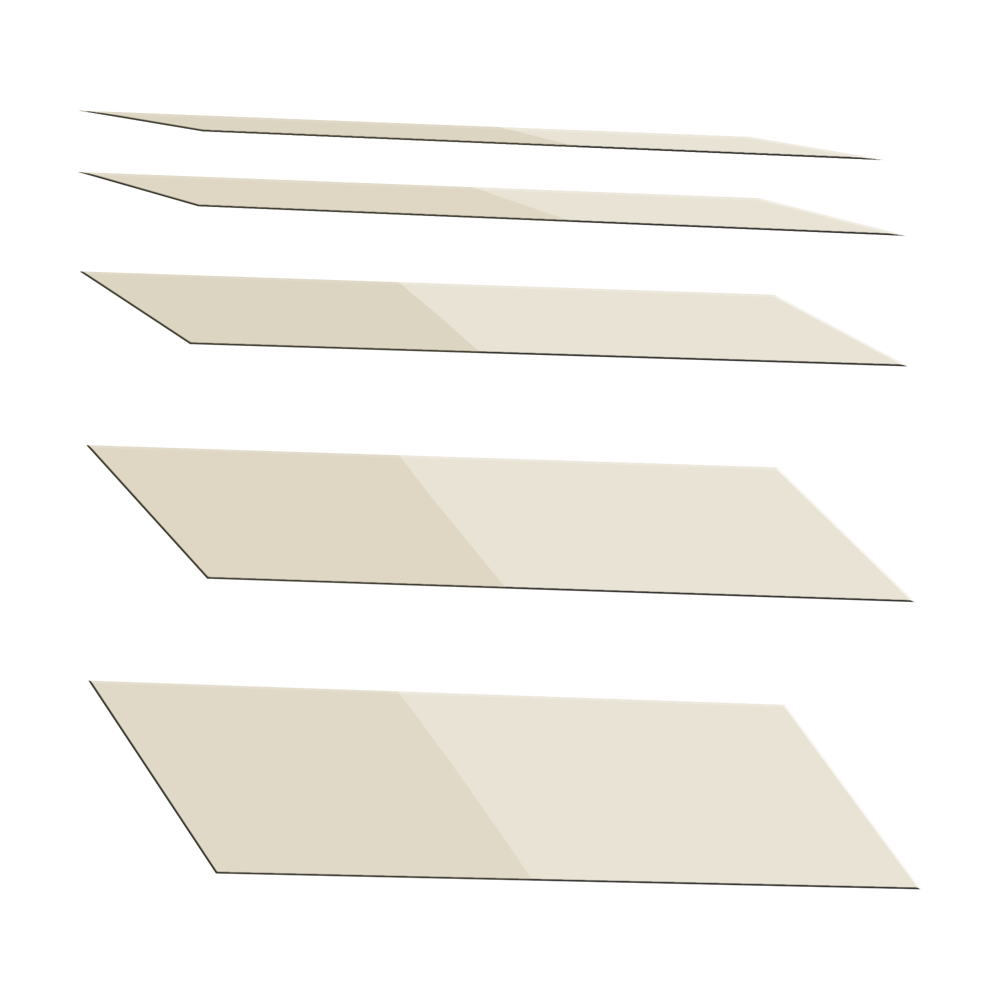

<div align="center">



# BetterBlinds Fuzzy Simulator

*An interactive 2D/2.5D classroom that proves why fuzzy control handles vague light better than crisp thresholds*

[](backend/requirements.txt)
[](frontend/package.json)
[](frontend/package.json)
[](#testing)
[](#)

[Features](#features) • [Quickstart](#quickstart) • [How It Works](#how-it-works) • [The Room](#the-room) • [Fuzzy Design](#fuzzy-design) • [Project Structure](#project-structure)

<video width="640" height="360" controls>
  <source src="docs/demo/betterblinds_demo.mp4" type="video/mp4">
  Your browser does not support the video tag.
</video>


</div>

A browser-based simulator of [BetterBlinds](docs/source_materials/BetterBlinds%20IMRAD.pdf), the IMRAD prototype (University of Cebu Lapu-Lapu & Mandaue, 2024) that used an LDR + Arduino + DC motor to chase harsh sunlight. The original controller was a crisp threshold: close at `≥819`, open at `≤250`, nothing in between.

This simulator replaces that threshold with a 2-input Mamdani fuzzy controller so the vague middle zone (`251–818`) gets gradual, human-like responses instead of a cliff at `500`.

## Features

- **Real blinds, not CSS spinners**: 10 venetian slats share one tilt state (`tiltOf` / `projectedHeight`), freeze their Y centers, and project via `W·sin φ + T·cos φ`. No screen-plane `rotate()`.
- **Persistent plant, not one-shot nudges**: the fuzzy `motorCommand ∈ [-1,1]` is a *velocity* (`TILT_DEADBAND 0.05`, `FULL_SWEEP_S 6s`). The scene integrates it every `requestAnimationFrame` until a limit; changing inputs changes *speed*, not a finite tween.
- **Raycast-style light without a 3D engine**: one shared `sunDirection` vector, per-row apertures (`gap − slatH`), slab march against the window *rectangle* (every column emits), smoothstep penumbra, gated 8-tap bloom, and `screen`-blended floor bands. Dim ends are overcast blue-grey, not black.
- **Honest ΔL**: `Auto ΔL` measures `L_t − L_{t−1}` from your Light drag and decays to Stable. Uncheck it to hand-probe the rule matrix. A `▲/▼` glyph by the sun makes the trend visible.
- **Live fuzzy transparency**: membership bars, 12-rule matrix, and weighted centroid math are all computed in pure Python and streamed as JSON.
- **Eight presets + boundary demo**: Dawn / Morning / Noon / Cloudy / Sunset / Sudden Brightening & Darkening / Reset, plus the `499 vs 500` anti-threshold proof.
- **Native demo shell**: `BetterBlinds.WinForms` (WebView2, .NET 8) hosts the built `dist/` for a WinForms window; no rewrite of the fuzzy core.

## Quickstart

### Web (recommended for development)

**Backend**

```bash
cd backend
python -m venv .venv            # Windows: .venv\Scripts\activate
# macOS: source .venv/bin/activate
pip install -r requirements.txt
flask --app app run --port 5000  # http://127.0.0.1:5000/api/health → {"status":"ok"}
```

**Frontend** (second terminal)

```bash
cd frontend
npm install
npm run dev                      # http://localhost:5173  (Vite)
```

### Windows demo shell (optional)

```bash
npm run build --prefix frontend
dotnet run --project BetterBlinds.WinForms   # WebView2 window: dev server if running, else dist/index.html
```

The shell probes `http://localhost:5173` first, falls back to `dist/index.html`, and launches Flask hidden (`python -m flask --app backend/app` or `backend-dist/backend.exe` via PyInstaller). No browser chrome.

## How It Works

```
Light (0–1023) ─┐
                ├─► fuzzify ─► min(μlight, μdelta) ─► clip ─► max ─► centroid ─► motorCommand [-1,1]
Delta (-200–200)┘         ▲ Mamdani                ▲         │
                          └─ 12 rules R01–R12 ─────┘         ▼
                                                  currentBlindTilt 0…1 (rAF integrator)
                                                         │
                                              ┌──────────┴──────────┐
                                           slat geometry        WebGL light
```

- **Inputs:** Light `L ∈ [0,1023]` (Arduino 10-bit `analogRead`) and `ΔL = L_t − L_{t−1} ∈ [-200,200]` (rising / stable / falling, with `Stable`'s flat top at `±15`).
- **MFs:** Light 4 sets (`Dark`/`Moderate`/`Bright`/`VeryBright`, `250–819` vague middle), Delta 3 sets (`Falling`/`Stable`/`Rising`), Motor 5 sets (`FastOpen`…`FastClose`) — all in `backend/fuzzy/config.py`.
- **Rules:** 12 `R01–R12` (one per Light×Delta cell, `§2.3` in `IMPLEMENTATION_PLAN.md`).
- **Inference:** `min` (AND → activation), `min` (implication → clip), `max` (aggregation), centroid over 1001 samples (201 on the surface endpoint).
- **Actuation:** U is a persistent velocity; the plant clamps `[0,1]` so limits stall even under a held command.

## The Room

**ClassroomScene** (`frontend/src/components/ClassroomScene.tsx`) is a front-elevation SVG at `viewBox 0 0 640 420`. `WIN {36,56,250,250}` is shared by glass, slats, and the WebGL layer. A blackboard shows live `LDR L=`, `dL=`, `U=`, and `SUN °`.

The lighting split is intentional:

- **SVG** owns the room, window frame, glass tint, sun disc, slats, cords, desks, and the scenario clock (preset-driven, not wall time — `Morning 8:00`, `Noon 12:00`, etc.; Sudden Brightening keeps time still).
- **WebGL** (`frontend/src/components/lighting/`) owns the floor bands: a fullscreen `Mesh` + `GlProgram` marching each room pixel *back* to the window *rectangle* (every column emits, penumbra ±5px aperture-scaled, gated bloom at `0.65`, screen blend, window early-out).

## Fuzzy Design

Domains are deliberate (`backend/fuzzy/config.py:29`):

- `LIGHT_RANGE 0–1023`: the hardware's ADC, anchoring the `819.2` / `249.8` paper averages.
- `DELTA_LIGHT_RANGE -200…200`: ~20% swings, so `+120` is a meaningful "sudden brightening" without needing `±500`.
- `MOTOR_RANGE -100…100` → `[-1,1]` on the wire: signed percent, symmetric around `Stop`, deadband `0.05` shared with the frontend.

`frontend/src/components/blindGeometry.ts` (`OPEN_PHI 3°`, `SLAT_CHORD 29`, `SLAT_EDGE 2.5`) is pure math so `tsc` + `oxlint` *and* a node harness can prove monotonic projection, early seal at `0.52` tilt, and rate-independent ordering before anyone opens a browser.

> [!IMPORTANT]
> One source of truth per concern: `config.py` for MFs, `blindGeometry.ts` for projection, `sunDirection` for light. No parallel fake geometry.

## Presets & Testing

Presets live **just below the scene** inside `scene-wrap`, always in-view, and no scrolling needed. Eight scenarios hit distinct rule rows. `Reset` clears state.

| Preset | Light | Sun | ΔL | Clock | Story |
|---|---|---|---|---|---|
| Dawn | 180 | 38° | 0 | 6:00 | Dark + stable |
| Morning | 380 | 32° | 0 | 8:00 | Moderate |
| Noon | 850 | 8° | 0 | 12:00 | VeryBright → drive shut |
| Cloudy | 280 | 28° | 0 | 10:30 | Overcast hold |
| Sunset | 320 | 35° | -8 | 18:00 | Falling → ease open |
| Sudden Brightening | 960 | 18° | +120 | — | VeryBright + rising → fast close |
| Sudden Darkening | 200 | 28° | -120 | — | Dark + falling → fast open |
| Reset | 500 | 25° | 0 | 9:00 | Neutral |

The full §7 proof (T1–T8 + sweep + `499 vs 500` smooth, `<0.02`) is green as `pytest` — 17 tests

Documented with screenshots in `docs/PHASE7.md` (`docs/figures/phase7-*.png`).

## Project Structure

```
betterblinds-fuzzy-simulator/
├── backend/
│   ├── app.py                      # POST /api/fuzzy/evaluate, GET /health|surface|membership-curves
│   ├── fuzzy/  config.py  membership.py  rules.py  inference.py  defuzzification.py  surface.py
│   └── scripts/plot_mfs.py         # matplotlib figures from live config (no drift)
├── frontend/
│   ├── src/
│   │   ├── App.tsx                 # Auto-ΔL + preset + sun-angle shell
│   │   ├── api.ts  types.ts
│   │   └── components/
│   │       ├── ClassroomScene.tsx / blindGeometry.ts   # tilt plant + projection
│   │       ├── lighting/  LightingLayer.tsx  sunlight.ts + lighting.ts
│   │       ├── FuzzyPanel.tsx  MembershipChart.tsx  ControlSurface.tsx
│   │       └── TestingPanel.tsx    # 8 presets + §7 cases (optional on the page)
│   └── package.json
├── BetterBlinds.WinForms/          # demo-only WebView2 shell (feat/winforms-wrapper)
├── docs/
│   ├── implementation_notes/       # IMPLEMENTATION_PLAN.md, NOTES.md, PHASE7.md
│   └── figures/  mf-*.png  phase7-*.png
└── CONTRIBUTING.md
```

Implementation history lives in `docs/implementation_notes/`; the fuzzy dashboard, MF plots and 3D surface are lazy-loaded Plotly components behind `Suspense`.

## Testing & Reports

```bash
# backend
pytest -q                          # 17 passed (fuzzy + surface)
python -m backend.scripts.plot_mfs # → docs/figures/mf-*.png (re-take after any config change)
# frontend
npm run build --prefix frontend    # tsc -b && vite build
npm run lint --prefix frontend     # oxlint
```

## Acknowledgments

Based on [BETTERBLINDS: An Automated Sunlight-Responsive Blinds* (University of Cebu Lapu-Lapu & Mandaue, April 2024)](docs/source_materials/BetterBlinds%20IMRAD.pdf). 
