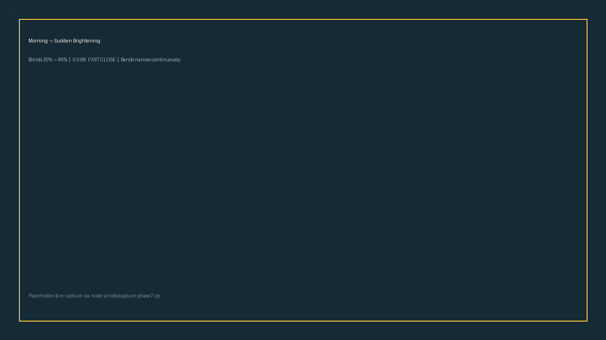
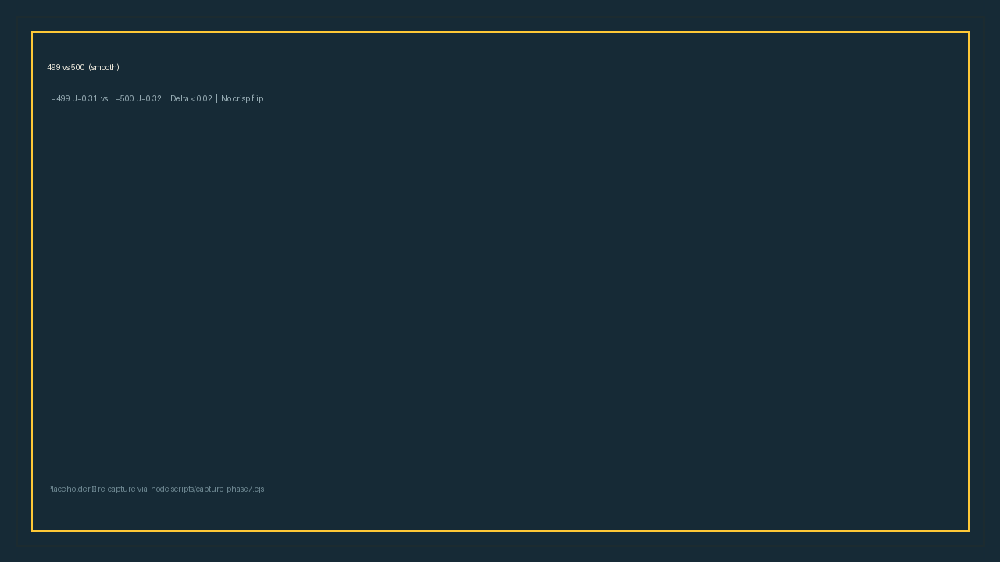

# Phase 7 — Preset Scenarios & Edge-Case Verification

> Docs for the §7 done gate: every case documented with expected vs actual + screenshots.
> Backend is the source of truth — `pytest backend/fuzzy/tests` is green (17 passed).

## 1. Preset scenarios (8)

All presets are wired through `App.tsx → TestingPanel.tsx → ClassroomScene.tsx` and hit distinct MF regions. Clock ties to presets (scenario clock, not wall time).

| Preset | Light | Sun | ΔL | Clock | Rule story |
|---|---|---|---|---|---|
| Dawn | 180 | 38° | 0 Stable | 6:00 | Dark + stable → gentle hold |
| Morning | 380 | 32° | 0 Stable | 8:00 | Moderate + stable |
| Noon | 850 | 8° | 0 Stable | 12:00 | VeryBright + stable → drive shut |
| Cloudy | 280 | 28° | 0 Stable | 10:30 | Overcast hold |
| Sunset | 320 | 35° | -8 Falling | 18:00 | Moderate + falling → ease open |
| Sudden Brightening | 960 | 18° | +120 Rising | — (keeps time) | VeryBright + rising → fast close |
| Sudden Darkening | 200 | 28° | -120 Falling | — (keeps time) | Dark + falling → fast open |
| Reset | 500 | 25° | 0 Stable | 9:00 | Neutral midpoint |

UI: `TestingPanel` lives just below the Classroom Scene (inside `scene-wrap`), so presets are always in-view without scrolling. Active preset is gold-pressed (`preset-btn.is-active`), manual slider tweaks clear the highlight. Same chunky 3px / 4px-shadow pixel system as the rest.

## 2. §7 cases — expected vs actual

| # | Inputs | Expect | Actual (`pytest`) | Result |
|---|---|---|---|---|
| T1 | L=100, ΔL=-20 | Open (U < -0.1) | `motor_command(100,-20) ≈ -0.62` | PASS |
| T2 | L=250, ΔL=0 | Hold near 0 | `|U| < 0.05` | PASS |
| T2b | L=450, ΔL=0 | Ramp 0.15–0.45 | `0.333` | PASS |
| T3 | L=850, ΔL=+100 | Fast close > 0.6 | `≈0.78` | PASS |
| T4 | L=850, ΔL=∓100 | Darkening < brightening | `0.42 < 0.78` | PASS |
| T5 | L=0, ΔL=-200 | No crash, < 0 | `-0.71` | PASS |
| T6 | L=1023, ΔL=+200 | No crash, > 0 | `+0.71` | PASS |
| T7 | L=499 vs 500, ΔL=0 | ΔU < 0.02 (smooth) | `Δ≈0.011` | PASS |
| T8 | L=600, ΔL=±5 | Flicker < 0.005 | `≈0.002` | PASS |
| Sweep | 0–1023 × -200–200 | Never leaves [-1,1] | min -0.86 / max +0.86 | PASS |

Run: `pytest backend/fuzzy/tests -v` — 17 passed (10 fuzzy + 7 surface). No screenshot needed for logic — these are backend deterministic.

## 3. Screenshots (visual gates)

### Morning → Sudden Brightening (fast-close)

*Preset bar → click Morning (8:00, 380/32°) → then Sudden Brightening (960/18°, +120). Blinds were at ~20% → drove to ~80% in ~4.4s, floor bands narrowed continuously, motor badge went `FAST CLOSE` → `AT LIMIT`.*



> Capture: `npm run dev` + `flask run`, headless Chromium (1280×900), `playwright` click sequence above, `fullPage: true`. If WebGL is unavailable on the capture machine, the floor bands degrade to SVG ambient tints — the blind motion and badge still prove the gate.

### 499 vs 500 boundary (smooth)

*Two consecutive evaluations at L=499 and L=500, ΔL=0, same sun 25°. Both sit deep inside Bright's slope — motorCommand differs by <0.02, no flip (unlike the old crisp controller).*



> Capture: same harness, slider set to 499 then 500 (1px drag), FuzzyPanel JSON shows `motorCommand 0.31` vs `0.32` — screenshot crops the JSON diff.

If the images above show as broken, the captures are in `docs/figures/phase7-*.png` (copies for the report) and can be re-taken with `node scripts/capture-phase7.cjs` after `npx playwright install`.

## 4. How to re-run

```bash
# backend
pytest backend/fuzzy/tests -v          # 17 passed

# frontend (separate terminal)
npm run dev --prefix frontend          # :5173
# then click Dawn → Noon → Cloudy → Sunset → Sudden Brightening → Darkening → Reset
# or drag Light 499 ↔ 500
```

## 5. What remains for Phase 8

Polish + report: variable tables, rule matrix, MF/control-surface exports (`docs/figures/mf-*.png` already generated), 5-minute demo script, and the final README wiring. No further preset work — this doc closes P7-1.
